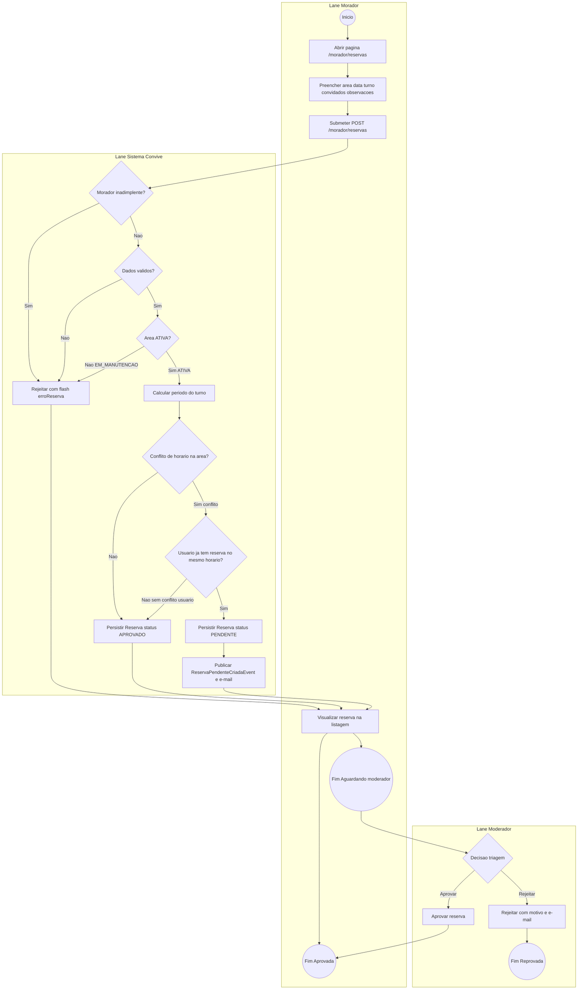

```mermaid
flowchart TB
    subgraph lane_morador [Lane Morador]
        start((Inicio))
        A1[Abrir pagina /morador/reservas]
        A2[Preencher area data turno convidados observacoes]
        A3[Submeter POST /morador/reservas]
        A9[Visualizar reserva na listagem]
        end_ok((Fim Aprovada))
        end_pend((Fim Aguardando moderador))
    end

    subgraph lane_sistema [Lane Sistema Convive]
        G1{Morador inadimplente?}
        G2{Dados validos?}
        G3{Area ATIVA?}
        G4{Conflito de horario na area?}
        G5{Usuario ja tem reserva no mesmo horario?}
        A4[Rejeitar com flash erroReserva]
        A5[Calcular periodo do turno]
        A6[Persistir Reserva status APROVADO]
        A7[Persistir Reserva status PENDENTE]
        A8[Publicar ReservaPendenteCriadaEvent e e-mail]
    end

    subgraph lane_moderador [Lane Moderador]
        G6{Decisao triagem}
        A10[Aprovar reserva]
        A11[Rejeitar com motivo e e-mail]
        end_rej((Fim Reprovada))
    end

    start --> A1 --> A2 --> A3 --> G1
    G1 -->|Sim| A4 --> A9
    G1 -->|Nao| G2
    G2 -->|Nao| A4
    G2 -->|Sim| G3
    G3 -->|Nao EM_MANUTENCAO| A4
    G3 -->|Sim ATIVA| A5 --> G4
    G4 -->|Sim conflito| G5
    G4 -->|Nao| A6 --> A9 --> end_ok
    G5 -->|Sim| A7 --> A8 --> A9 --> end_pend
    G5 -->|Nao sem conflito usuario| A6

    end_pend --> G6
    G6 -->|Aprovar| A10 --> end_ok
    G6 -->|Rejeitar| A11 --> end_rej
```