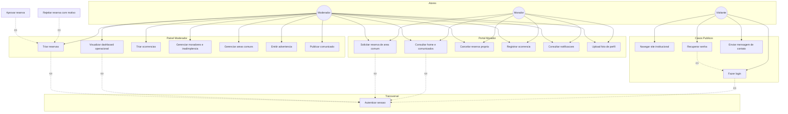

```mermaid
flowchart TB
    subgraph atores [Atores]
        V((Visitante))
        M((Morador))
        MOD((Moderador))
    end

    subgraph publico [Casos Publicos]
        UC1[Navegar site institucional]
        UC2[Fazer login]
        UC3[Recuperar senha]
        UC4[Enviar mensagem de contato]
    end

    subgraph morador_uc [Portal Morador]
        UC5[Consultar home e comunicados]
        UC6[Solicitar reserva de area comum]
        UC7[Cancelar reserva propria]
        UC8[Registrar ocorrencia]
        UC9[Consultar notificacoes]
        UC10[Upload foto de perfil]
    end

    subgraph moderador_uc [Painel Moderador]
        UC11[Visualizar dashboard operacional]
        UC12[Triar reservas]
        UC13[Triar ocorrencias]
        UC14[Gerenciar moradores e inadimplencia]
        UC15[Gerenciar areas comuns]
        UC16[Emitir advertencia]
        UC17[Publicar comunicado]
    end

    subgraph transversal [Transversal]
        UC_AUTH[Autenticar sessao]
    end

    V --> UC1
    V --> UC2
    V --> UC3
    V --> UC4

    M --> UC5
    M --> UC6
    M --> UC7
    M --> UC8
    M --> UC9
    M --> UC10

    MOD --> UC5
    MOD --> UC6
    MOD --> UC7
    MOD --> UC8
    MOD --> UC9
    MOD --> UC10
    MOD --> UC11
    MOD --> UC12
    MOD --> UC13
    MOD --> UC14
    MOD --> UC15
    MOD --> UC16
    MOD --> UC17

    UC2 -.->|"<<include>>"| UC_AUTH
    UC5 -.->|"<<include>>"| UC_AUTH
    UC6 -.->|"<<include>>"| UC_AUTH
    UC11 -.->|"<<include>>"| UC_AUTH
    UC12 -.->|"<<include>>"| UC_AUTH

    UC3 -.->|"<<extend>>"| UC2
    UC12_REJ[Rejeitar reserva com motivo] -.->|"<<extend>>"| UC12
    UC12_APR[Aprovar reserva] -.->|"<<extend>>"| UC12
```