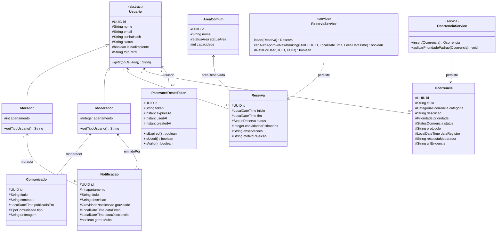

```mermaid
classDiagram
    direction TB

    class Usuario {
        <<abstract>>
        #UUID id
        #String nome
        #String email
        #String senhaHash
        #String status
        #boolean isInadimplente
        #String fotoPerfil
        +getTipoUsuario() String*
    }

    class Morador {
        #int apartamento
        +getTipoUsuario() String
    }

    class Moderador {
        #Integer apartamento
        +getTipoUsuario() String
    }

    class AreaComum {
        #UUID id
        #String nome
        #StatusArea statusArea
        #int capacidade
    }

    class Reserva {
        #UUID id
        #LocalDateTime inicio
        #LocalDateTime fim
        #StatusReserva status
        #Integer convidadosEstimados
        #String observacoes
        #String motivoRejeicao
    }

    class Ocorrencia {
        #UUID id
        #String titulo
        #CategoriaOcorrencia categoria
        #String descricao
        #Prioridade prioridade
        #StatusOcorrencia status
        #String protocolo
        #LocalDateTime dataRegistro
        #String respostaModerador
        #String urlEvidencia
    }

    class Comunicado {
        #UUID id
        #String titulo
        #String conteudo
        #LocalDateTime publicadoEm
        #TipoComunicado tipo
        #String urlImagem
    }

    class Notificacao {
        #UUID id
        #int apartamento
        #String titulo
        #String descricao
        #GravidadeNotificacao gravidade
        #LocalDateTime dataEnvio
        #LocalDateTime dataOcorrencia
        #boolean gerouMulta
    }

    class PasswordResetToken {
        #UUID id
        #String token
        #Instant expiresAt
        #Instant usedAt
        #Instant createdAt
        +isExpired() boolean
        +isUsed() boolean
        +isValid() boolean
    }

    class ReservaService {
        <<service>>
        +insert(Reserva) Reserva
        +canAutoApproveNewBooking(UUID, UUID, LocalDateTime, LocalDateTime) boolean
        +deleteForUser(UUID, UUID) boolean
    }

    class OcorrenciaService {
        <<service>>
        +insert(Ocorrencia) Ocorrencia
        +aplicarPrioridadePadrao(Ocorrencia) void
    }

    Usuario <|-- Morador
    Usuario <|-- Moderador

    Usuario "1" <-- "0..*" Reserva : reservadoPor
    AreaComum "1" <-- "0..*" Reserva : areaReservada
    Usuario "1" <-- "0..*" Ocorrencia : usuario
    Moderador "1" <-- "0..*" Comunicado : moderador
    Moderador "1" <-- "0..*" Notificacao : emitidoPor
    Morador "1" <-- "0..*" Notificacao : morador
    Usuario "1" <-- "0..*" PasswordResetToken : usuario

    ReservaService ..> Reserva : persiste
    OcorrenciaService ..> Ocorrencia : persiste
```