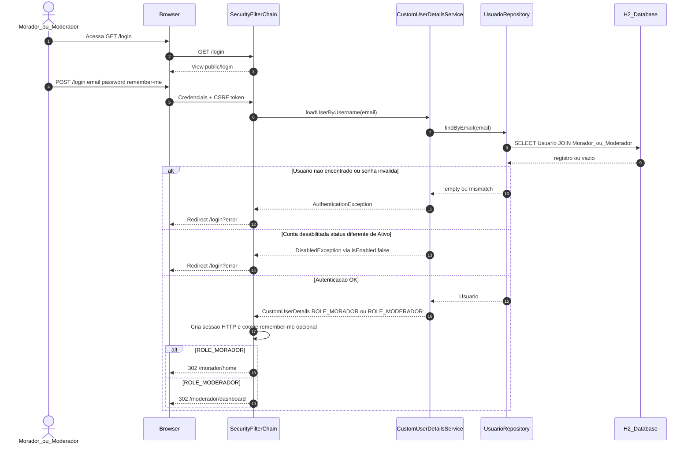

```mermaid
sequenceDiagram
    autonumber
    actor U as Morador_ou_Moderador
    participant B as Browser
    participant SC as SecurityFilterChain
    participant UDS as CustomUserDetailsService
    participant UR as UsuarioRepository
    participant DB as H2_Database

    U->>B: Acessa GET /login
    B->>SC: GET /login
    SC-->>B: View public/login

    U->>B: POST /login email password remember-me
    B->>SC: Credenciais + CSRF token
    SC->>UDS: loadUserByUsername(email)
    UDS->>UR: findByEmail(email)
    UR->>DB: SELECT Usuario JOIN Morador_ou_Moderador
    DB-->>UR: registro ou vazio

    alt Usuario nao encontrado ou senha invalida
        UR-->>UDS: empty ou mismatch
        UDS-->>SC: AuthenticationException
        SC-->>B: Redirect /login?error
    else Conta desabilitada status diferente de Ativo
        UDS-->>SC: DisabledException via isEnabled false
        SC-->>B: Redirect /login?error
    else Autenticacao OK
        UR-->>UDS: Usuario
        UDS-->>SC: CustomUserDetails ROLE_MORADOR ou ROLE_MODERADOR
        SC->>SC: Cria sessao HTTP e cookie remember-me opcional
        alt ROLE_MORADOR
            SC-->>B: 302 /morador/home
        else ROLE_MODERADOR
            SC-->>B: 302 /moderador/dashboard
        end
    end
```