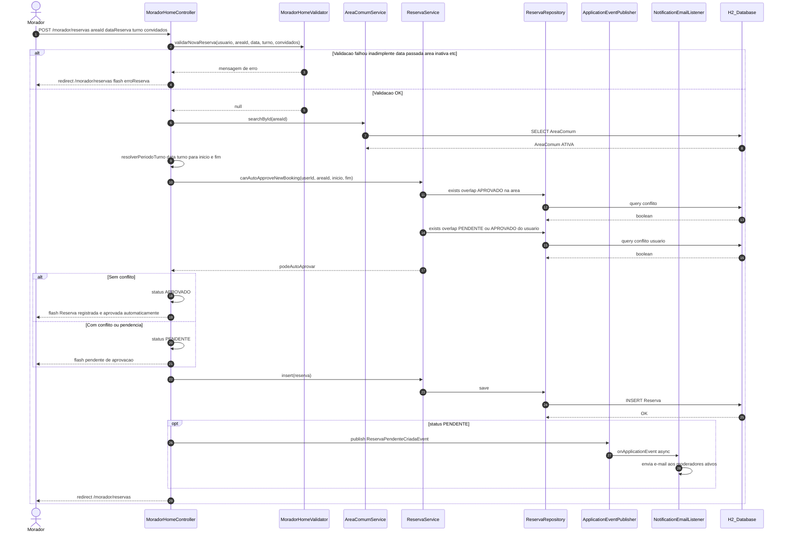

```mermaid
sequenceDiagram
    autonumber
    actor M as Morador
    participant C as MoradorHomeController
    participant V as MoradorHomeValidator
    participant AS as AreaComumService
    participant RS as ReservaService
    participant RR as ReservaRepository
    participant EP as ApplicationEventPublisher
    participant L as NotificationEmailListener
    participant DB as H2_Database

    M->>C: POST /morador/reservas areaId dataReserva turno convidados
    C->>V: validarNovaReserva(usuario, areaId, data, turno, convidados)

    alt Validacao falhou inadimplente data passada area inativa etc
        V-->>C: mensagem de erro
        C-->>M: redirect /morador/reservas flash erroReserva
    else Validacao OK
        V-->>C: null
        C->>AS: searchById(areaId)
        AS->>DB: SELECT AreaComum
        DB-->>AS: AreaComum ATIVA
        C->>C: resolverPeriodoTurno data turno para inicio e fim
        C->>RS: canAutoApproveNewBooking(userId, areaId, inicio, fim)
        RS->>RR: exists overlap APROVADO na area
        RR->>DB: query conflito
        DB-->>RR: boolean
        RS->>RR: exists overlap PENDENTE ou APROVADO do usuario
        RR->>DB: query conflito usuario
        DB-->>RR: boolean
        RS-->>C: podeAutoAprovar

        alt Sem conflito
            C->>C: status APROVADO
            C-->>M: flash Reserva registrada e aprovada automaticamente
        else Com conflito ou pendencia
            C->>C: status PENDENTE
            C-->>M: flash pendente de aprovacao
        end

        C->>RS: insert(reserva)
        RS->>RR: save
        RR->>DB: INSERT Reserva
        DB-->>RR: OK

        opt status PENDENTE
            C->>EP: publish ReservaPendenteCriadaEvent
            EP->>L: onApplicationEvent async
            L->>L: envia e-mail aos moderadores ativos
        end

        C-->>M: redirect /morador/reservas
    end
```