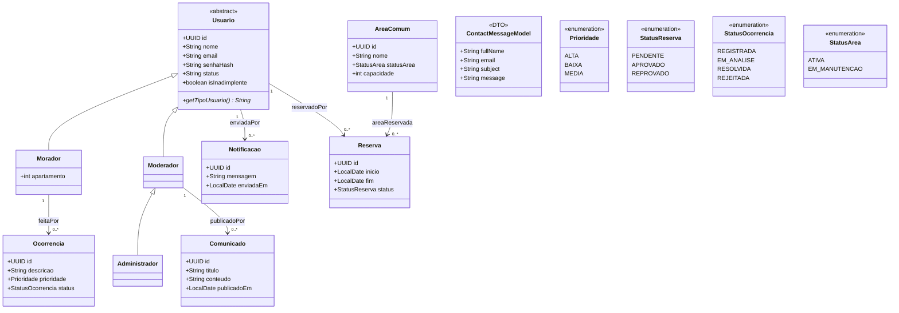
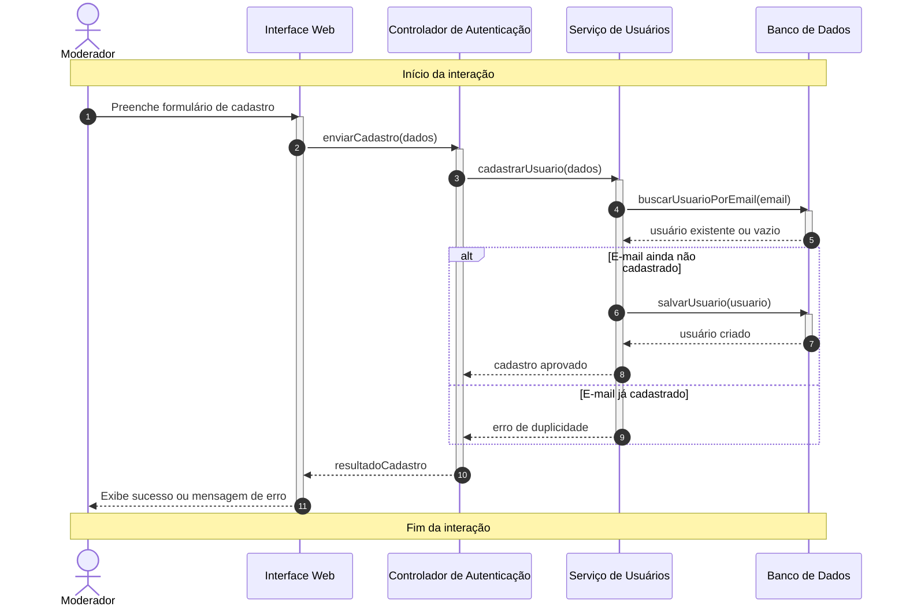
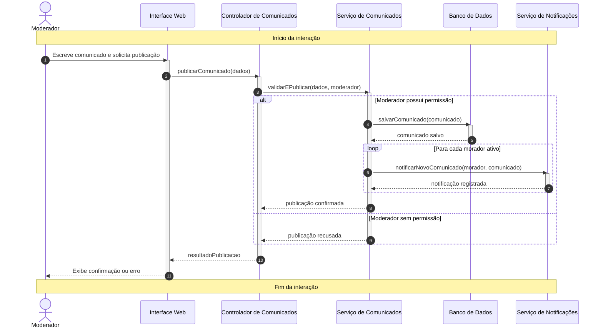
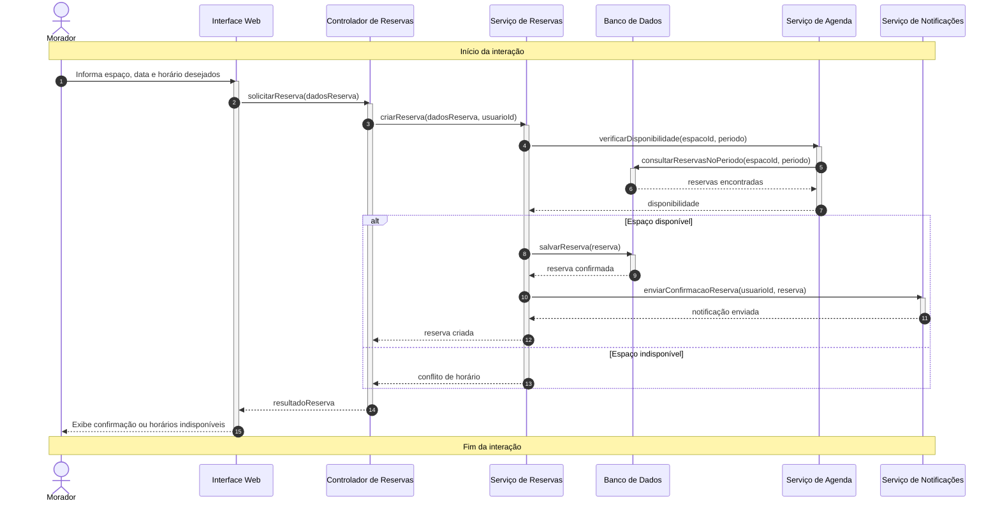
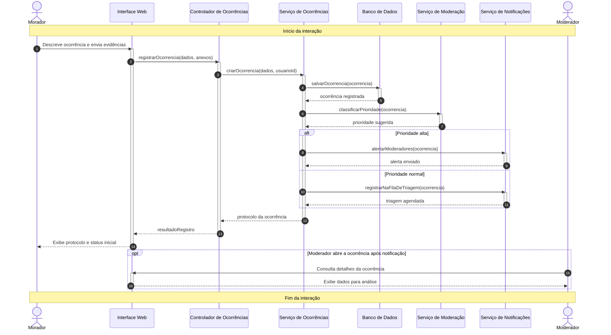
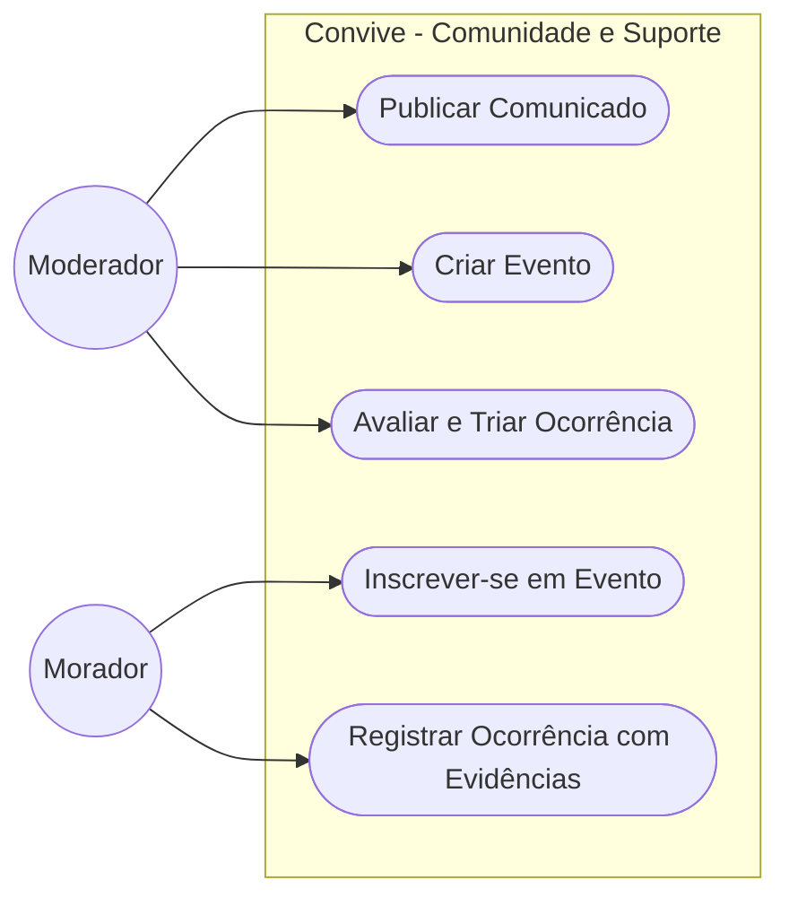
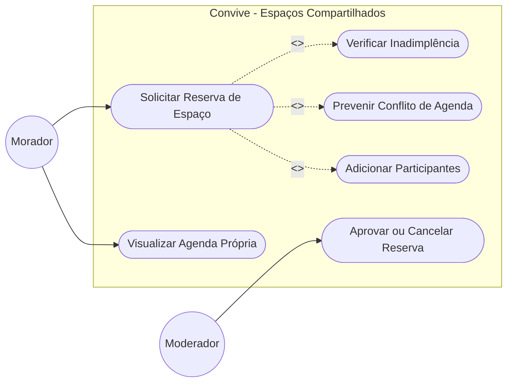
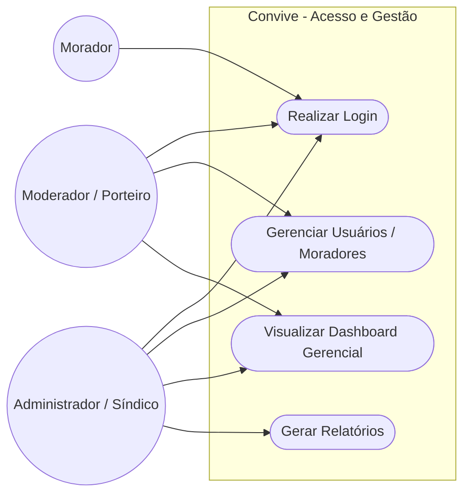

# Diagramas

# Diagrama de classes completo

# Diagrama de cadastro de usuário

# Diagrama publicação de comunicado para a comunidade

# Diagrama de reserva de espaços

# Diagrama cadastro de ocorrencias

# Diagrama caso de uso Ocorrências 

# Diagrama caso de uso Reservas

# Diagrama caso de uso Acessos

