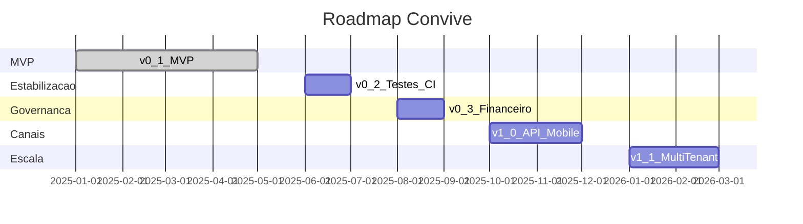
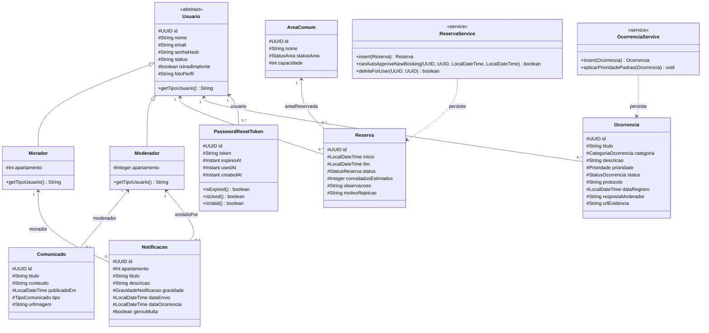
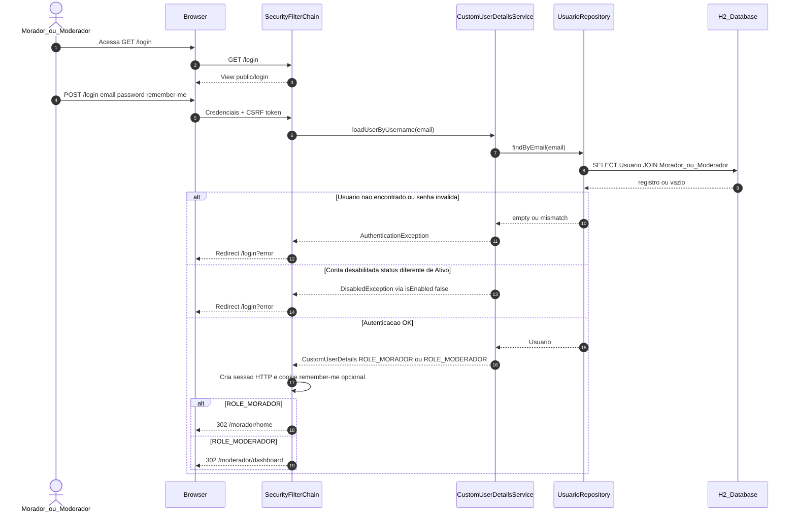
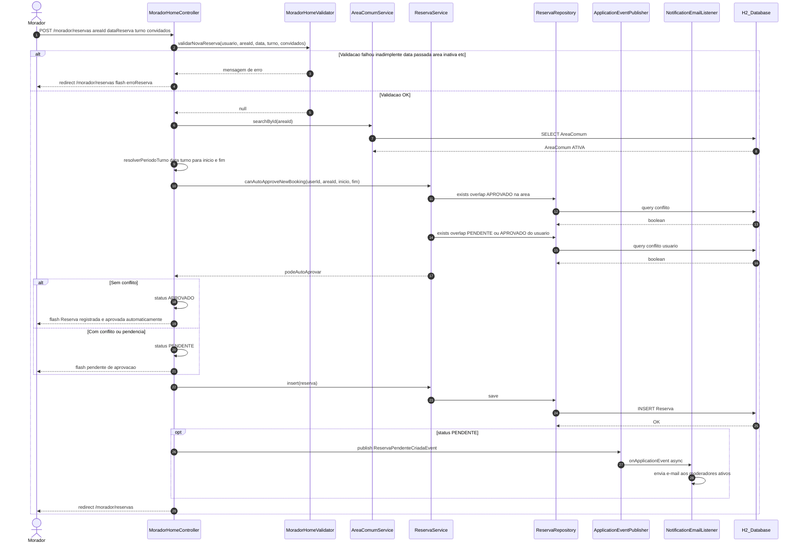
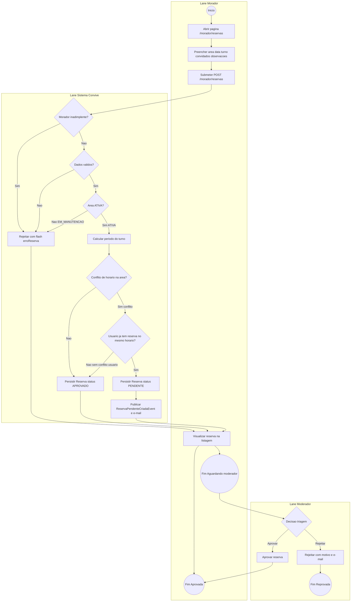

# Documento de Projeto de Software

**Projeto:** Convive — Plataforma de Gestão Condominial  
**Versão do documento:** 1.0  
**Stack principal:** Java 21, Spring Boot 3.2.4, Spring Data JPA, Spring Security, Thymeleaf, H2, TailwindCSS  
**Arquitetura:** MVC server-side (renderização HTML; sem API REST JSON no escopo atual)

---

## Seção 1: Visão e Escopo do Projeto

### Documento de Visão

#### Problema

A administração de condomínios costuma depender de canais dispersos — grupos de mensagens, planilhas, cadernos na portaria e e-mails avulsos — para coordenar reservas de áreas comuns, registrar reclamações, publicar avisos e controlar inadimplência. Esse modelo gera conflitos de agenda, perda de rastreabilidade, demora na resposta da síndica e baixa transparência para o morador.

O **Convive** resolve esse problema ao centralizar, em uma única aplicação web, os fluxos operacionais do condomínio: comunicação oficial, reservas com regras de conflito, registro de ocorrências com protocolo sequencial, advertências formais e painel operacional para a administração.

#### Público-alvo

| Persona | Papel no sistema | Necessidades atendidas |
|---------|------------------|------------------------|
| **Morador** | `ROLE_MORADOR` | Consultar comunicados, reservar áreas, abrir ocorrências, receber notificações/advertências, cancelar reservas próprias |
| **Moderador / Síndico** | `ROLE_MODERADOR` | Dashboard com KPIs, triagem de reservas e ocorrências, gestão de moradores e áreas, emissão de advertências, publicação de comunicados |
| **Visitante** | Não autenticado | Conhecer o produto, contato, login, recuperação de senha |
| **Portaria** | *Não implementado* | Previsto no roadmap como ator externo (controle de acesso físico) |

#### Objetivos de negócio

1. **Eficiência operacional:** reduzir tempo de triagem com auto-aprovação de reservas sem conflito e filas priorizadas no dashboard.
2. **Comunicação facilitada:** mural de comunicados e notificações por e-mail em eventos críticos (`OcorrenciaCriadaEvent`, `ReservaPendenteCriadaEvent`, `ReservaRejeitadaEvent`).
3. **Rastreabilidade:** protocolos de ocorrência no formato `YYYY-NNNN` e histórico de status.
4. **Governança:** flag de inadimplência bloqueia novas reservas; moderador controla advertências e multas (`gerouMulta`).
5. **Segurança e segregação:** Spring Security com papéis distintos e sessão autenticada (BCrypt + CSRF).

---

### Requisitos

#### Requisitos Funcionais (RF)

| ID | Requisito | Evidência no código |
|----|-----------|---------------------|
| RF-01 | Autenticar usuário por e-mail e senha com redirecionamento por perfil | `SecurityConfig`, `CustomUserDetailsService` |
| RF-02 | Manter sessão com opção "lembrar-me" (7 dias) | `SecurityConfig.rememberMe` |
| RF-03 | Recuperar senha via token opaco com expiração | `PasswordResetService`, `PasswordResetToken` |
| RF-04 | Exibir home do morador com preview de comunicados e reservas | `MoradorHomeController` → `/morador/home` |
| RF-05 | Criar reserva de área comum por data e turno (manhã/tarde/noite/integral) | `MoradorHomeController`, `MoradorHomeValidator` |
| RF-06 | Auto-aprovar reserva sem conflito de horário na área | `ReservaService.canAutoApproveNewBooking` |
| RF-07 | Encaminhar reserva conflituosa para triagem (`PENDENTE`) e notificar moderadores | `ReservaPendenteCriadaEvent` |
| RF-08 | Moderador aprovar ou rejeitar reserva (com motivo) | `TriagemReservasController` |
| RF-09 | Bloquear reserva para morador inadimplente | `MoradorHomeValidator`, `ReservaService.insert` |
| RF-10 | Registrar ocorrência com categoria, prioridade padrão e protocolo anual | `OcorrenciaService.insert` |
| RF-11 | Triagem de ocorrências (status, prioridade, resposta do moderador) | `TriagemOcorrenciasController` |
| RF-12 | Publicar e listar comunicados (com imagem opcional) | `ComunicadoController`, `ComunicadoService` |
| RF-13 | Emitir advertência/notificação ao morador com gravidade e flag de multa | `AdvertenciaModeradorController` |
| RF-14 | Dashboard operacional com KPIs e gráficos | `DashboardModeradorController`, `DashboardService` |
| RF-15 | CRUD de moradores/moderadores e controle de inadimplência | `MoradorUsuarioController` |
| RF-16 | CRUD de áreas comuns com status `ATIVA` / `EM_MANUTENCAO` | `AreaComumModeradorController` |
| RF-17 | Upload de foto de perfil | `UserController` → `/perfil/upload-foto` |
| RF-18 | Página pública de contato por e-mail | `ContactController` |

#### Requisitos Não Funcionais (RNF)

| ID | Requisito | Implementação |
|----|-----------|---------------|
| RNF-01 | Autenticação segura | BCrypt (`PasswordEncoder`), form login, contas com `status = "Ativo"` |
| RNF-02 | Autorização baseada em papéis | `ROLE_MORADOR`, `ROLE_MODERADOR`; rotas `/morador/**` e `/moderador/**` |
| RNF-03 | Proteção CSRF | Ativo em formulários Thymeleaf (`_csrf`) |
| RNF-04 | Persistência relacional | Spring Data JPA + Hibernate; H2 em arquivo |
| RNF-05 | Desacoplamento de e-mail | `ApplicationEventPublisher` + `NotificationEmailListener` (assíncrono) |
| RNF-06 | Paginação e scroll infinito | Endpoints `*/mais` retornando fragmentos Thymeleaf |
| RNF-07 | Fuso horário consistente | `America/Sao_Paulo` em validações de data |
| RNF-08 | Responsividade | TailwindCSS + design system (`Docs/Design.md`) |
| RNF-09 | Integração contínua | GitHub Actions (`ci.yml`, `deploy.yml`) |
| RNF-10 | Manutenibilidade | Camadas Controller → Service → Repository; Lombok |
| RNF-11 | Rastreabilidade de uploads | `FileStorageService` + `app.upload.dir` |
| RNF-12 | Disponibilidade em desenvolvimento | Porta 8085; seed `DataInitializer` |

---

### Priorização Estratégica

#### Técnica MoSCoW

| Prioridade | Item | Justificativa |
|------------|------|---------------|
| **Must** | Login, portal morador (home, reservas, ocorrências), triagem reservas/ocorrências | Núcleo do valor do produto e critérios de avaliação LP2 |
| **Must** | Gestão de áreas comuns e regra de inadimplência | Sem áreas não há reservas; inadimplência é regra de negócio central |
| **Must** | Comunicados e dashboard moderador | Comunicação síndico↔morador e visão operacional |
| **Should** | Advertências/notificações, reset de senha, upload de foto | Melhoram governança e UX, mas o condomínio opera sem eles no curto prazo |
| **Should** | E-mail assíncrono em eventos | Reforça SLA percebido; depende de SMTP configurado |
| **Could** | Página pública (landing, features, about, contact) | Marketing e institucional |
| **Won't (agora)** | API REST, app mobile, módulo portaria, multi-condomínio | Fora do MVP; alto esforço arquitetural |

#### Matriz de Impacto × Esforço

| Quadrante | Requisitos | Decisão |
|-----------|------------|---------|
| **Alto impacto / Baixo esforço** | RF-05/06 (reservas + auto-aprovação), RF-10 (protocolo ocorrência), RF-04 (home) | **Fazer primeiro** — já implementados no MVP |
| **Alto impacto / Alto esforço** | RF-14 (dashboard agregado), RF-08/11 (triagens), RF-15 (gestão usuários) | **Planejar sprints** — complexidade de queries e UX moderador |
| **Baixo impacto / Baixo esforço** | RF-18 (contato), RF-17 (foto perfil) | **Quick wins** pós-MVP |
| **Baixo impacto / Alto esforço** | API REST + mobile, multi-condomínio | **Evitar** na disciplina atual |

**Por que MoSCoW e Impacto×Esforço juntas?**

- **MoSCoW** define o *corte de escopo* para MVP acadêmico com prazo fixo, evitando gold-plating.
- **Impacto×Esforço** ordena o backlog *dentro* de cada faixa MoSCoW, priorizando entregas que maximizam valor percebido (morador + síndico) com o time reduzido do projeto.

---

### MVP e Roadmap

#### Produto Mínimo Viável (MVP)

Escopo alinhado ao código atual em produção local:

- Autenticação por sessão (morador e moderador).
- Portal do morador: home, reservas (criar/cancelar), ocorrências, comunicados (leitura), notificações.
- Painel do moderador: dashboard, triagem de reservas e ocorrências, gestão de moradores, áreas comuns, advertências, publicação de comunicados.
- Infraestrutura: JPA/H2, e-mails por eventos, reset de senha, CI.

#### Roadmap de Releases

| Release | Horizonte | Entregas |
|---------|-----------|----------|
| **v0.1 — MVP** | Atual | Todos os RF Must/Should listados; seed de dados; deploy via GitHub Actions |
| **v0.2 — Estabilização** | +4 semanas | Testes automatizados (JUnit/MockMvc), tratamento de erros unificado, correção de rotas legadas, documentação OpenAPI interna |
| **v0.3 — Governança** | +8 semanas | Integração financeira (inadimplência automática), relatórios exportáveis (PDF/CSV), auditoria de ações do moderador |
| **v1.0 — Canais** | +12 semanas | API REST + JWT, app mobile (Flutter/React Native), notificações push |
| **v1.1 — Escala** | +16 semanas | Multi-condomínio (tenant), papel portaria, assembleias virtuais e enquetes |



---

## Seção 2: Modelagem de Software (UML)

### Diagrama de Classes

Modelo de domínio extraído das entidades JPA em `com.EC6.Convive.Model`. Herança `JOINED` em `Usuario`; relacionamentos apenas `@ManyToOne` (lado filho → pai).



**Enums de domínio:**

| Enum | Valores |
|------|---------|
| `StatusReserva` | `PENDENTE`, `APROVADO`, `REPROVADO` |
| `StatusOcorrencia` | `REGISTRADA`, `EM_ANALISE`, `RESOLVIDA`, `REJEITADA` |
| `StatusArea` | `ATIVA`, `EM_MANUTENCAO` |
| `Prioridade` | `NAO_DEFINIDA`, `ALTA`, `MEDIA`, `BAIXA` |
| `CategoriaOcorrencia` | `BARULHO`, `INFRAESTRUTURA`, `LIMPEZA`, `REGRAS`, `OUTRO` |
| `TipoComunicado` | `Obras`, `Reunião`, `Eventos`, `Geral` |
| `GravidadeNotificacao` | `BAIXA`, `MEDIA`, `ALTA` |

---

### Diagrama de Casos de Uso

```mermaid
flowchart TB
    subgraph atores [Atores]
        V((Visitante))
        M((Morador))
        MOD((Moderador))
    end

    subgraph publico [Casos Publicos]
        UC1[Navegar site institucional]
        UC2[Fazer login]
        UC3[Recuperar senha]
        UC4[Enviar mensagem de contato]
    end

    subgraph morador_uc [Portal Morador]
        UC5[Consultar home e comunicados]
        UC6[Solicitar reserva de area comum]
        UC7[Cancelar reserva propria]
        UC8[Registrar ocorrencia]
        UC9[Consultar notificacoes]
        UC10[Upload foto de perfil]
    end

    subgraph moderador_uc [Painel Moderador]
        UC11[Visualizar dashboard operacional]
        UC12[Triar reservas]
        UC13[Triar ocorrencias]
        UC14[Gerenciar moradores e inadimplencia]
        UC15[Gerenciar areas comuns]
        UC16[Emitir advertencia]
        UC17[Publicar comunicado]
    end

    subgraph transversal [Transversal]
        UC_AUTH[Autenticar sessao]
    end

    V --> UC1
    V --> UC2
    V --> UC3
    V --> UC4

    M --> UC5
    M --> UC6
    M --> UC7
    M --> UC8
    M --> UC9
    M --> UC10

    MOD --> UC5
    MOD --> UC6
    MOD --> UC7
    MOD --> UC8
    MOD --> UC9
    MOD --> UC10
    MOD --> UC11
    MOD --> UC12
    MOD --> UC13
    MOD --> UC14
    MOD --> UC15
    MOD --> UC16
    MOD --> UC17

    UC2 -.->|"<<include>>"| UC_AUTH
    UC5 -.->|"<<include>>"| UC_AUTH
    UC6 -.->|"<<include>>"| UC_AUTH
    UC11 -.->|"<<include>>"| UC_AUTH
    UC12 -.->|"<<include>>"| UC_AUTH

    UC3 -.->|"<<extend>>"| UC2
    UC12_REJ[Rejeitar reserva com motivo] -.->|"<<extend>>"| UC12
    UC12_APR[Aprovar reserva] -.->|"<<extend>>"| UC12
```

Atores e casos de uso do MVP, com relações `<<include>>` e `<<extend>>`.



---

### Diagrama de Sequência — Caso de Uso 1: Autenticação (Login)

Fluxo real: **form login** com sessão HTTP (não JWT).



---

### Diagrama de Sequência — Caso de Uso 2: Reserva de Área Comum

Fluxo `POST /morador/reservas` com validação, auto-aprovação e evento assíncrono.



**Turnos e horários (fuso `America/Sao_Paulo`):**

| Turno | Início | Fim |
|-------|--------|-----|
| `manha` | 08:00 | 12:00 |
| `tarde` | 13:00 | 17:00 |
| `noite` | 18:00 | 23:00 |
| `integral` | 08:00 | 23:00 |

---

## Seção 3: Modelagem de Processos (BPMN)

Processo central: **Reserva de Área Comum** — simulado em flowchart Mermaid com lanes (pools), gateways e eventos de início/fim.



**Legenda BPMN simulada:**

| Símbolo | Significado |
|---------|-------------|
| `((Inicio))` / `((Fim ...))` | Eventos de início e fim |
| `[Atividade]` | Tarefa executada pelo ator da lane |
| `{Gateway?}` | Decisão exclusiva (XOR) |
| `Lane *` | Pool de responsabilidade (Morador, Sistema, Moderador) |

---

## Seção 4: Especificação de Funcionalidade para Desenvolvimento

### História de usuário selecionada

**US-RES-01:** Como **morador adimplente**, quero **reservar uma área comum** escolhendo data e turno, **para** utilizar o espaço sem conflito de agenda com outros moradores.

**Critérios de aceite (derivados do código):**

1. Apenas áreas com `StatusArea.ATIVA` aparecem como reserváveis.
2. Data da reserva não pode ser anterior a hoje (`America/Sao_Paulo`).
3. Turno deve ser `manha`, `tarde`, `noite` ou `integral`.
4. Convidados entre 1 e a capacidade da área (quando informado).
5. Se não houver conflito, status `APROVADO` imediato; caso contrário, `PENDENTE` e e-mail aos moderadores.
6. Morador inadimplente recebe mensagem de bloqueio sem persistir reserva.

**Rotas:** `GET/POST /morador/reservas`, `POST /morador/reservas/{id}/cancelar`  
**Arquivos:** `MoradorHomeController`, `MoradorHomeValidator`, `morador/reservas.html`

---

### Wireframes e Storyboard (ASCII)

#### Tela 1 — Listagem de reservas (`/morador/reservas`)

```
+------------------------------------------------------------------+
| [=] Convive          Olá, Maria (Apt 302)              [avatar]   |
+------------------------------------------------------------------+
|  MINHAS RESERVAS                          [ + Nova Reserva ]      |
+------------------------------------------------------------------+
| [!] flash erroReserva / sucessoReserva (banner dismissível)     |
+------------------------------------------------------------------+
|  +------------------------+  +------------------------+           |
|  | Salão de Festas        |  | Churrasqueira          |           |
|  | 15/06/2026 - Tarde     |  | 20/06/2026 - Noite     |           |
|  | [APROVADO]             |  | [PENDENTE]             |           |
|  | 20 convidados          |  | Aguardando síndico     |           |
|  | [Cancelar]             |  |                        |           |
|  +------------------------+  +------------------------+           |
|                                                                  |
|  (scroll infinito: GET /morador/reservas/mais?page=N)            |
+------------------------------------------------------------------+
|  Nav: Home | Reservas* | Ocorrências | Comunicados | Notificações |
+------------------------------------------------------------------+
```

#### Tela 2 — Modal / formulário "Nova Reserva"

Disparado pelo botão **Nova Reserva**; `method="POST"` `action="/morador/reservas"` com token CSRF.

```
+------------------------------------------+
|  Nova Reserva                        [X] |
+------------------------------------------+
|  Área comum *                            |
|  [ v Selecione a área          ▼ ]       |
|     - Salão de Festas (cap. 50)          |
|     - Churrasqueira (cap. 15)            |
|     (áreas EM_MANUTENCAO não listadas)   |
|                                          |
|  Data *                                  |
|  [ ____/____/______ ]  (date, ISO)       |
|                                          |
|  Turno *                                 |
|  ( ) Manhã  08h-12h                      |
|  ( ) Tarde  13h-17h                      |
|  ( ) Noite  18h-23h                      |
|  ( ) Integral 08h-23h                    |
|                                          |
|  Convidados estimados                    |
|  [ ________ ]  (opcional, min 1)         |
|                                          |
|  Observações                             |
|  [________________________________]      |
|  (max 2000 caracteres)                   |
|                                          |
|        [ Cancelar ]  [ Confirmar ]       |
+------------------------------------------+
```

**Campos enviados:** `areaId` (UUID), `dataReserva` (ISO DATE), `turno`, `convidadosEstimados`, `observacoes`.

#### Tela 3 — Feedback pós-submissão (redirect com flash)

```
Cenário A — Auto-aprovada:
  [✓] "Reserva registrada e aprovada automaticamente."
      (flash: sucessoReserva, verde)

Cenário B — Pendente:
  [✓] "Sua solicitação de reserva foi registrada e está pendente de aprovação."
      (flash: sucessoReserva, azul)

Cenário C — Erro de validação:
  [✗] "Não é possível realizar a reserva. Constam pendências financeiras..."
      ou "A data não pode ser no passado." / "Turno inválido." etc.
      (flash: erroReserva, vermelho)
```

#### Tela 4 — Card atualizado na listagem

```
+------------------------------------------+
| Churrasqueira                            |
| 22/06/2026 · Integral (08h-23h)          |
| Status: [ PENDENTE ]                     |
| Obs: Festa família                       |
| (sem botão cancelar se política futura)  |
+------------------------------------------+
```

**Storyboard narrativo:**

1. Morador abre **Reservas** → vê histórico paginado.  
2. Clica **Nova Reserva** → preenche área, data futura, turno e convidados.  
3. Sistema valida → auto-aprova ou deixa pendente → redirect com banner.  
4. Listagem recarrega com novo card e badge de status.

---

### Casos de Teste Funcionais

#### CT-RES-01 — Caminho feliz (auto-aprovação)

| Campo | Descrição |
|-------|-----------|
| **ID** | CT-RES-01 |
| **História** | US-RES-01 |
| **Objetivo** | Verificar reserva aprovada automaticamente sem conflito |
| **Pré-condições** | Morador autenticado com `isInadimplente = false`; área "Salão" com `StatusArea.ATIVA` e capacidade ≥ 10; não existe reserva `APROVADO` no mesmo intervalo; morador sem reserva `PENDENTE`/`APROVADO` conflitante no mesmo espaço/horário |
| **Dados de teste** | `areaId` = UUID do Salão; `dataReserva` = amanhã; `turno` = `tarde`; `convidadosEstimados` = `10` |

**Passos:**

1. Acessar `GET /morador/reservas` autenticado como morador de teste.
2. Submeter `POST /morador/reservas` com os dados de teste e CSRF válido.
3. Verificar redirect para `/morador/reservas`.
4. Consultar banco: registro em `Reserva` com `status = APROVADO`, `inicio` = data 13:00, `fim` = data 17:00.
5. Verificar flash `sucessoReserva` = *"Reserva registrada e aprovada automaticamente."*
6. Confirmar que **não** foi publicado `ReservaPendenteCriadaEvent` (opcional: mock do publisher).

**Resultado esperado:** Reserva persistida como `APROVADO`; mensagem de sucesso exibida; card visível na listagem com badge verde "APROVADO".

---

#### CT-RES-02 — Caminho de erro (morador inadimplente)

| Campo | Descrição |
|-------|-----------|
| **ID** | CT-RES-02 |
| **História** | US-RES-01 |
| **Objetivo** | Impedir reserva quando há pendências financeiras |
| **Pré-condições** | Morador autenticado com `isInadimplente = true`; área ativa disponível |
| **Dados de teste** | `areaId` válido; `dataReserva` = amanhã; `turno` = `manha` |

**Passos:**

1. Acessar `GET /morador/reservas` como morador inadimplente.
2. Submeter `POST /morador/reservas` com dados válidos de data/turno.
3. Verificar redirect para `/morador/reservas` sem novo registro aprovado.
4. Consultar banco: **nenhuma** nova linha em `Reserva` para esse pedido (validação ocorre antes do `insert`).
5. Verificar flash `erroReserva` = *"Não é possível realizar a reserva. Constam pendências financeiras em seu cadastro."*

**Resultado esperado:** Operação bloqueada na camada `MoradorHomeValidator`; mensagem de erro exibida; contagem de reservas do morador inalterada.

---

#### CT-RES-03 — Caminho de erro complementar (área em manutenção)

| Campo | Descrição |
|-------|-----------|
| **ID** | CT-RES-03 |
| **Pré-condições** | Área com `StatusArea.EM_MANUTENCAO` |
| **Passos** | Submeter reserva para essa área |
| **Resultado esperado** | Flash `erroReserva` = *"Este ambiente não está disponível para reserva."*; sem persistência |

---

## Apêndice: Link para o Repositório do Projeto

**Repositório LP2:** [Inserir o link do repositório do projeto de LP2 aqui]

---

## Referências técnicas internas

| Recurso | Caminho |
|---------|---------|
| README do produto | `README.md` |
| Design system | `Docs/Design.md` |
| Configuração de segurança | `Convive/src/main/java/com/EC6/Convive/Config/SecurityConfig.java` |
| Entidades JPA | `Convive/src/main/java/com/EC6/Convive/Model/` |
| Autores | Diogo Santos Rodrigues, Leonardo Rosário Teixeira |

---

*Documento gerado com base no estado atual do repositório Convive-WebApp. Autenticação documentada como sessão HTTP (form login); tokens JWT não fazem parte do escopo implementado.*
