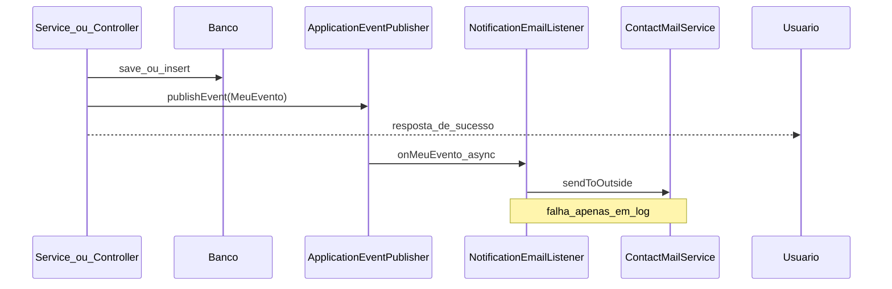

# Roteiro: nova notificação por e-mail (assíncrona)

Este documento descreve como adicionar um novo envio de e-mail em qualquer fluxo do Convive, seguindo o padrão já adotado no projeto: **persistir primeiro**, **publicar evento**, **enviar e-mail em background** sem abortar o fluxo principal.

## Visão geral

O envio SMTP fica centralizado em:

- [`ContactMailService`](../Convive/src/main/java/com/EC6/Convive/Service/ContactMailService.java) — adapter de e-mail
- [`NotificationEmailListener`](../Convive/src/main/java/com/EC6/Convive/Listener/NotificationEmailListener.java) — monta mensagens e dispara o envio
- [`AsyncConfig`](../Convive/src/main/java/com/EC6/Convive/Config/AsyncConfig.java) — pool de threads `convive-mail-`

Os fluxos de negócio **não** chamam `ContactMailService` diretamente (exceto o formulário público de contato).



## Padrão em 3 passos

### 1. Criar um evento (record)

Crie um record em `com.EC6.Convive.Event` com **apenas os dados necessários** para montar o corpo do e-mail (strings, datas, IDs). Evite passar entidades JPA inteiras.

**Exemplo existente:** [`OcorrenciaCriadaEvent`](../Convive/src/main/java/com/EC6/Convive/Event/OcorrenciaCriadaEvent.java)

```java
package com.EC6.Convive.Event;

import java.time.LocalDateTime;

public record ComunicadoPublicadoEvent(
        String titulo,
        String resumo,
        LocalDateTime dataPublicacao
) {
}
```

### 2. Publicar o evento após persistência

No **service** (preferível) ou no controller, injete `ApplicationEventPublisher` e publique **somente depois** de `save` / `insert` bem-sucedido.

**Exemplo no service:** [`OcorrenciaService.insert`](../Convive/src/main/java/com/EC6/Convive/Service/OcorrenciaService.java)

```java
Ocorrencia saved = ocorrenciaRepository.save(ocorrencia);

eventPublisher.publishEvent(new OcorrenciaCriadaEvent(
        saved.getDataRegistro(),
        saved.getUsuario().getNome(),
        saved.getDescricao()
));

return saved;
```

**Exemplo no controller (com condição):** [`MoradorHomeController`](../Convive/src/main/java/com/EC6/Convive/Controller/MoradorHomeController.java) — publica `ReservaPendenteCriadaEvent` só se o status for `PENDENTE`, após `reservaService.insert(reserva)`.

#### Regras obrigatórias

| Regra | Motivo |
|-------|--------|
| Publicar **depois** do `save` / `insert` | Evita e-mail sem registro no banco |
| Não chamar `ContactMailService` no fluxo de negócio | Falha SMTP não deve abortar a operação |
| Preferir publicar no **service** | Controllers mais enxutos e lógica reutilizável |
| Usar dados primitivos no evento | Entidades JPA podem estar detached fora da transação |

### 3. Adicionar handler no `NotificationEmailListener`

Abra [`NotificationEmailListener.java`](../Convive/src/main/java/com/EC6/Convive/Listener/NotificationEmailListener.java) e adicione um método com `@Async` e `@EventListener`:

```java
@Async(AsyncConfig.MAIL_TASK_EXECUTOR)
@EventListener
public void onComunicadoPublicado(ComunicadoPublicadoEvent event) {
    ContactMessageModel base = new ContactMessageModel();
    base.setSubject("Novo comunicado publicado");
    base.setMessage("""
            Foi publicado um novo comunicado: %s

            Resumo: %s
            Data: %s
            """.formatted(
            event.titulo(),
            event.resumo(),
            event.dataPublicacao().format(FORMATTER)
    ));

    notifyModeradores(base, "ComunicadoPublicado");
}
```

Não é necessário criar novo executor nem habilitar `@Async` de novo — [`AsyncConfig`](../Convive/src/main/java/com/EC6/Convive/Config/AsyncConfig.java) já está configurado.

## Quem notificar?

| Destinatário | Método no listener |
|--------------|-------------------|
| Todos os moderadores ativos | `notifyModeradores(base, "NomeDoEvento")` |
| Um e-mail específico (morador, etc.) | `sendSafely(mensagem, email, "NomeDoEvento")` |
| Caixa do formulário de contato do site | **Não use este padrão** — ver seção abaixo |

**Exemplos no projeto:**

- Moderadores: `onOcorrenciaCriada`, `onReservaPendenteCriada`
- Morador específico: `onReservaRejeitada`

## Eventos já implementados

| Evento | Publicado em | Handler |
|--------|--------------|---------|
| `OcorrenciaCriadaEvent` | `OcorrenciaService.insert` | `onOcorrenciaCriada` |
| `ReservaPendenteCriadaEvent` | `MoradorHomeController` (após insert, se `PENDENTE`) | `onReservaPendenteCriada` |
| `ReservaRejeitadaEvent` | `TriagemReservasController.rejeitarReserva` | `onReservaRejeitada` |

## Quando **não** usar este padrão

### Formulário de contato (`/contact`)

O usuário precisa de feedback imediato se o SMTP falhar. Mantenha o envio **síncrono** em [`ContactController`](../Convive/src/main/java/com/EC6/Convive/Controller/ContactController.java) com `try/catch` e atributo `contactMailError` na view.

### Feedback obrigatório na tela sobre entrega

Eventos assíncronos não devolvem erro HTTP ao usuário. Falhas ficam apenas no log do listener.

## Checklist para novo e-mail

- [ ] Criar record em `Convive/src/main/java/com/EC6/Convive/Event/`
- [ ] Injetar `ApplicationEventPublisher` no service (ou controller, se inevitável)
- [ ] Chamar `publishEvent(...)` **após** `save` / `insert`
- [ ] Adicionar método `@Async` + `@EventListener` em `NotificationEmailListener`
- [ ] Usar `notifyModeradores` ou `sendSafely` (nunca propagar exceção de SMTP)
- [ ] Teste unitário do service: verificar publicação do evento
- [ ] Teste unitário do listener: mock de `ContactMailService` e falha SMTP sem exceção propagada

## Testes

### Service — publicação do evento

Exemplo: [`OcorrenciaServiceTest`](../Convive/src/test/java/com/EC6/Convive/Service/OcorrenciaServiceTest.java) — usa `ArgumentCaptor` para validar que `eventPublisher.publishEvent` foi chamado com o evento correto após o `save`.

### Listener — falha isolada

Exemplo: [`NotificationEmailListenerTest`](../Convive/src/test/java/com/EC6/Convive/Listener/NotificationEmailListenerTest.java) — simula `MailSendException` e confirma que o handler não propaga a exceção.

Para testes de integração com `@Async`, use `SyncTaskExecutor` no profile de teste ou mock do listener.

## Limitações conhecidas

- Se a JVM reiniciar entre o `save` e a execução do listener, o e-mail pode não ser enviado (janela curta).
- Não há retry automático; falhas aparecem apenas nos logs (`log.error` em `sendSafely`).
- Para garantia de entrega após restart, evoluir para padrão **outbox** (tabela + job agendado) ou fila (RabbitMQ/SQS).

## Evolução futura (opcional)

Se o service passar a usar `@Transactional`, troque `@EventListener` por:

```java
@TransactionalEventListener(phase = TransactionPhase.AFTER_COMMIT)
```

no handler, para garantir envio somente após commit no banco.

## Referência rápida de arquivos

| Papel | Caminho |
|-------|---------|
| Config async | `Convive/src/main/java/com/EC6/Convive/Config/AsyncConfig.java` |
| Eventos | `Convive/src/main/java/com/EC6/Convive/Event/` |
| Listener | `Convive/src/main/java/com/EC6/Convive/Listener/NotificationEmailListener.java` |
| SMTP | `Convive/src/main/java/com/EC6/Convive/Service/ContactMailService.java` |
| DTO de mensagem | `Convive/src/main/java/com/EC6/Convive/Model/ContactMessageModel.java` |
