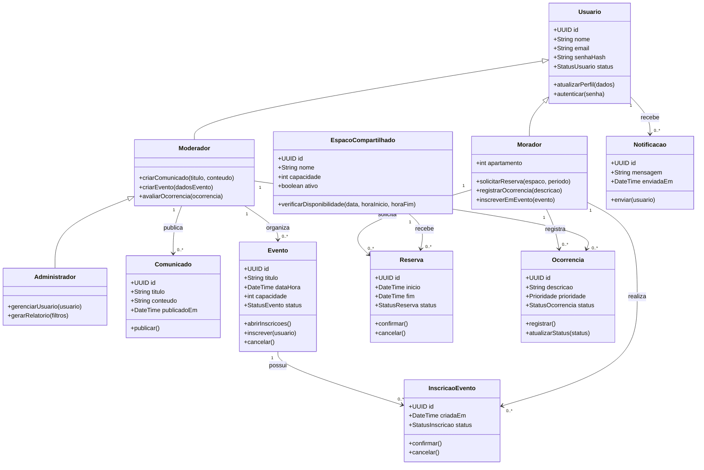
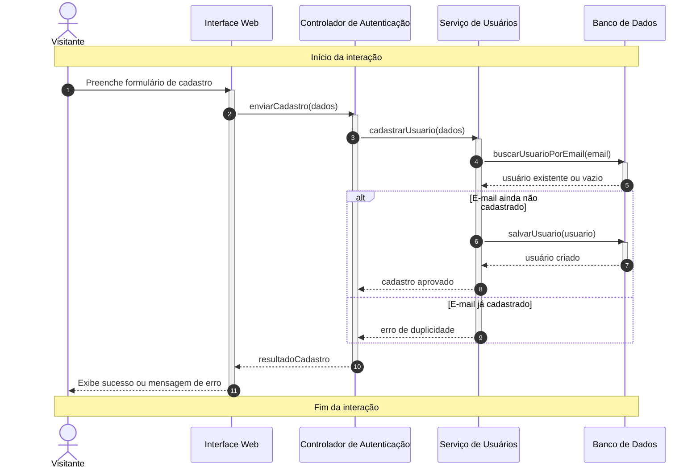
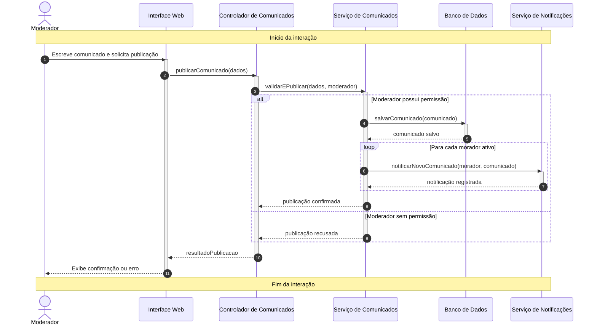
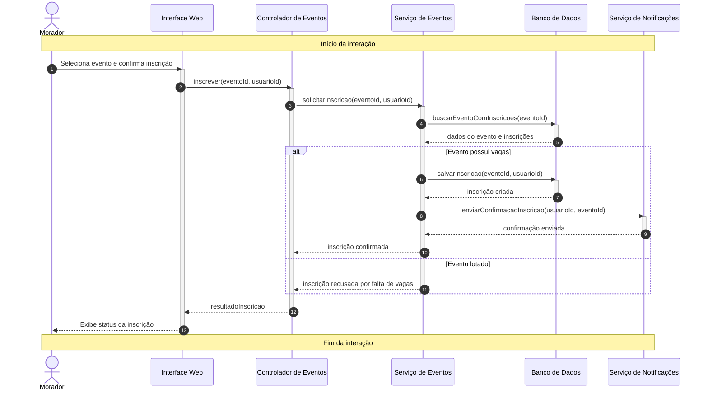
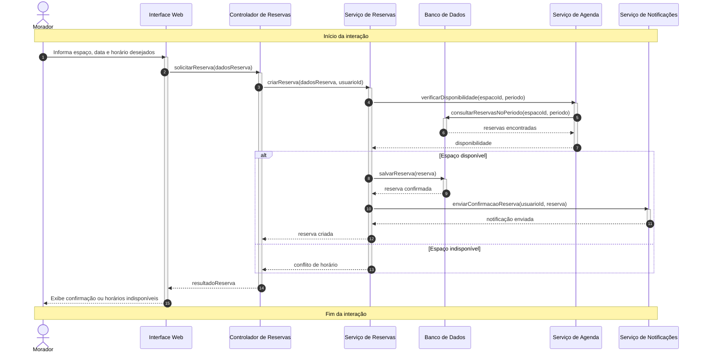
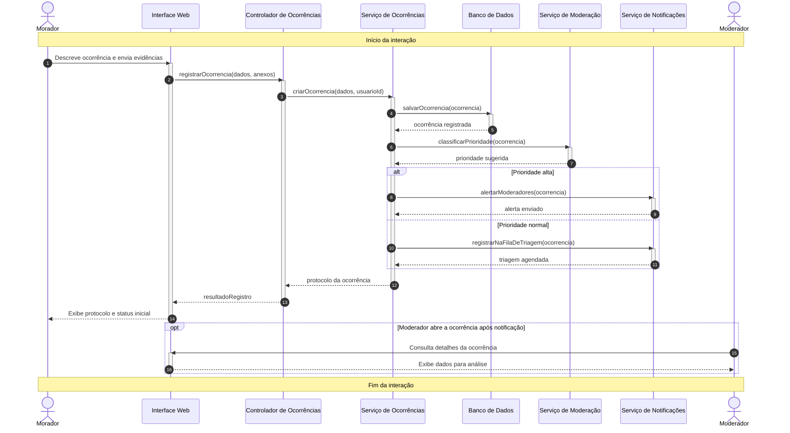

# Diagramas UML - Convive

## Diagrama de Classes

## Diagramas de Sequência

### 1. Cadastro e autenticação de usuário

### 2. Publicação de comunicado para a comunidade

### 3. Inscrição de morador em evento

### 4. Reserva de espaço compartilhado

### 5. Registro e triagem de ocorrência

